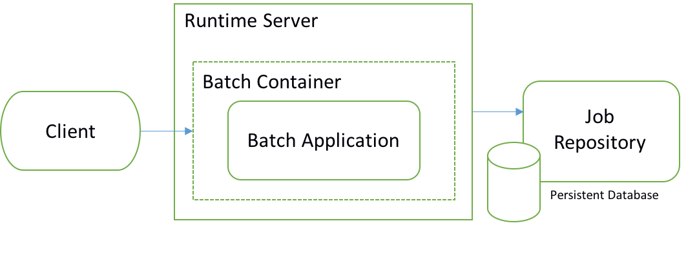
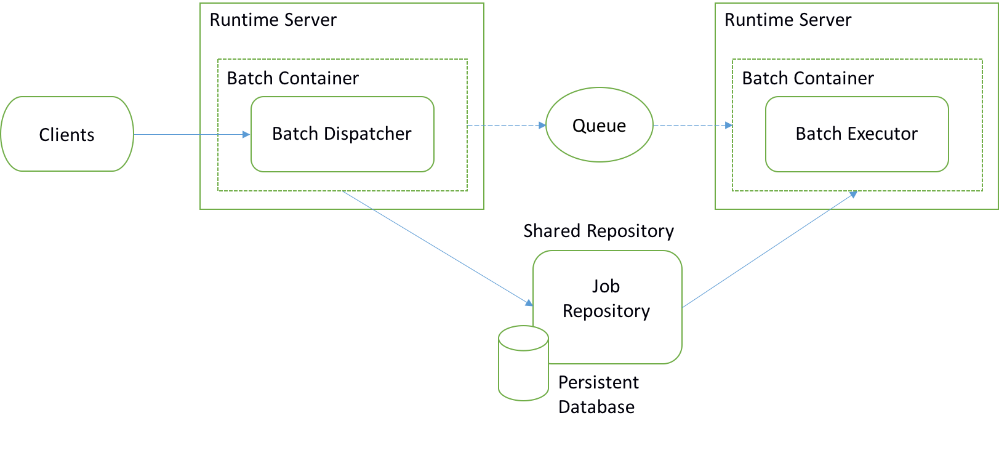

Java batch in CICS concepts
===========================

Authors: Evan Zhou, Tony Fitzgerald

The *Batch Applications for the Java Platform*
([JSR-352](https://jcp.org/en/jsr/detail?id=352)) standard is now
supported for CICS TS V5.3 with Liberty as
[announced](http://www.ibm.com/common/ssi/cgi-bin/ssialias?infotype=an&subtype=ca&supplier=897&letternum=ENUS216-354)
in October 2016. This article introduces the concepts of batch
processing and looks at how the WebSphere Liberty support for JSR 352
can allow online and batch to co-exist to support true 24×7 operations
within CICS.

What is batch processing?
-------------------------

In general, there are two types of transaction processing workload:
Online Transaction Processing (OLTP) and batch processing. OLTP is
characterized as interactive with data access scoped by fine-grained
requests, and typically needs to complete within a response time
measured in milliseconds. In comparison, batch processing is
non-interactive, background execution of data or compute intensive work
and is frequently long-running. Batch processing can be executed
sequentially or in parallel, and is initiated through various invocation
models including ad-hoc, scheduled, and on-demand.

Batch processing has been widely used for decades in disciplines such as
payroll, payment processing, claims processing, inventory management,
credit card processing, credit risk analysis, and report generation. It
is closely associated with a centralized server providing powerful I/O
capability -- unquestionably the territory of the mainframe! Programs
run in batch are often written in high-performance compiled languages
like COBOL, PL/I and C.

The majority of work in CICS today is OLTP, although batch applications
do sometimes call CICS programs to use facilities and data not available
in the batch environment.

Why write batch applications in Java?
-------------------------------------

Java has become a popular language with developers, constantly
improving, and critical business applications across many industries are
now written using it. To better serve batch requirements, the Java
community consolidated the experience of numerous batch experts and
developed an industry-wide standard known as JSR-352. This Java
specification establishes a standard batch programming model and fits
well with the broader Java EE 7 Full Platform. Batch processing by its
nature is iterative, which means Java classes are highly likely to be
Just-In-Time (JIT) compiled into well-performing native routines.
Additionally for z/OS customers, Java batch applications are eligible
for zIIP offload in the same manner as other Java applications on z/OS
providing the potential to significantly reduce software license
charging.

The evolution of Java batch can be summarized as:

-   *Roll your own --* This is a design built around the launcher
    concept, and the [BPXBATCH USS
    utility](http://www.ibm.com/support/knowledgecenter/SSLTBW_2.2.0/com.ibm.zos.v2r2.cbcux01/bpxbatr.htm)
    or the [JZOS Batch
    Toolkit](http://www.ibm.com/systems/z/os/zos/tools/java/products/jzos/overview.html)
    for Java launcher can be used to run the main method of a Java
    class. This Java class can then use the JZOS toolkit to access z/OS
    operating system services and data, including VSAM data.
-   *Competing batch frameworks* -- such as Spring Batch, and IBM
    Compute Grid. CICS provided the [Feature Pack for Modern
    Batch](http://www.ibm.com/support/knowledgecenter/SSGMCP_5.3.0/com.ibm.cics.ts.modernbatch.doc/welcome/WelcomePage.html)
    that is based on IBM Compute Grid and allows batch applications to
    be executed in a batch container inside the CICS JVM server and run
    in parallel with OLTP applications.
-   *The open standard JSR 352: Batch Applications for the Java Platform
    --* This is based on the existing patterns and experiences of batch
    implementations, so experienced JCL and COBOL developers are likely
    to be comfortable with the concepts.

Java batch is now ready for broad adoption.

Why run Java batch in CICS?
---------------------------

Firstly, OLTP has become a 24×7 operation in response to increasing
global availability. People from different time zones require access at
all times of day and night. Although there are times when online
processing volumes fluctuate, in a global economy it rarely ceases. This
means that batch and online processing are required to operate
simultaneously in a co-operative manner. To that extent, batch in CICS
is a very viable proposition as it provides containers and controls for
both.

Secondly, JSR 352 applies to both Java Standard Edition (SE) and Java
Enterprise Edition (EE) environments and thus a large proportion of
batch APIs can be served by a single Java SE/EE application server such
as CICS. CICS is well positioned as a first class mixed-language
application server. By partnering with WebSphere Liberty, and with CICS
TS V5.3 plus the latest service, JSR 352 is now supported in both
integrated and standard modes of the Liberty JVM server. For a more
detailed introduction and comparison of integrated and standard modes, see [Configuring a Liberty JVM server](https://www.ibm.com/support/knowledgecenter/SSGMCP_5.4.0/configuring/java/config_jvmserver_liberty.html/).

Further, for data intensive batch processing CICS has access to critical
data in VSAM, DB2 and IMS. CICS can act as a data connector for batch
applications for example by using the JDBC and JCICS APIs, or linking to
and reusing CICS programs that are tried and tested. In terms of
transaction management, batch is designed to checkpoint regularly
thereby dividing the whole batch into a series of more manageable,
recoverable, resilient chunks. Each chunk is managed by an implicit XA
transaction which is coordinated by the Liberty transaction manager with
CICS acting as an XA participant. Using XA transactions also means you
can update non-CICS managed data within a transaction, for instance data
in a remote data base such as DB2 or Derby accessed using a type 4
database driver.

To conclude, the combination of CICS and Liberty are an excellent choice
for batch applications on the mainframe.

Liberty features for Java batch
-------------------------------

Liberty implements JSR-352 and provides additional unique features and
qualities that make it ready for the enterprise:

-   *WebSphere Developer Tools (WDT)*

The WebSphere Developer Tools help you get started developing batch
applications. They enable you to create applications and compose jobs
using the [Job Specification Language] (JSL). You can then use the
tools to deploy and test your application on a local or remote Liberty
server.

-   *Role-based security*

You can secure the Liberty batch environment using role-based security.
Users can be a part of one or more batch roles: batchAdmin,
batchSubmitter, and batchMonitor. By configuring a user registry and
authorization roles, an administrator can restrict access to batch
operations and job instance data through the batch REST API or
JobOperator interface. Security is included as part of batch right out
of the box and it is easy to configure using Liberty's basic registry.
As your batch users grow you can switch to use an LDAP user registry or
a SAF registry on z/OS.

-   *Batch REST API*

The batch REST API provides a complete set of operations to manage your
batch environment. The REST interface gives you the flexibility to use
your favourite REST clients and scripting languages to remotely manage
jobs. It provides start/submit, stop, and restart functions along with
the ability to view the job execution status, data, and logs.

-   *Job logging*

Use job logging to audit your batch jobs and debug potential problems in
your batch applications. As your applications progress from development
to production you can fine-tune the level of logging to suit your
auditing needs.

-   *Multi-server support*

Adding the batch management feature enables multi-server batch
functionality. This provides a way to build a robust, highly available,
and highly scalable batch topology.

-   *Batch manager command line interface*

The batchManager command line utility is a convenient mechanism for
calling the remote management API. The batch manager is a natural
integration point with your existing business process work flows and
external schedulers since it is able to wait for job completion and to
return completion codes back to your existing workload automation. For
example, you can run batchManager from standard JCL and Tivoli
automation products, and the utility allows for discovery of job log
information, and to retrieve the job log for archiving if desired.

The Liberty support for Java batch provides a standards-based approach
to developing batch applications that can be securely managed and scaled
into a highly available topology. Whether you are generating internal
reports or processing loan applications, Java batch can be a powerful
tool.

Topology considerations
-----------------------

The simplest topology is to handle everything within a single Liberty
server as shown below. Job requests are submitted to a server, where the
batch application is executed. However, Java batch can also split the
workload over multiple batch containers to build a robust, highly
available, and highly scalable solution.

Similar to TOR and AOR roles in CICS for OLTP workload, there are two
roles in a batch topology

1.  **Batch dispatcher** to receive requests and to route requests like
    a TOR
2.  **Batch executor** to execute batch applications like an AOR

You can scale the numbers of batch dispatchers and batch executors
according to your requirements. Having more than one batch dispatcher
provides for better availability. It is a good practice to architect
multiple batch executors to split workload across different application
hosts and to allow the batch to run in parallel. More executors means
better isolation, higher availability, increased scalability and in many
cases more throughput.

To enable a multiple server topology, bear in mind the following two
requirements.

-   Firstly, a REST interface must be used to submit jobs. If you have
    an application calling the JSR-352 defined JobOperator API then
    those jobs will always run in the server where the JobOperator was
    called, regardless of your topology.
-   Secondly, a shared persistent database called the Job Repository is
    created and used by Liberty to keep track of the progress of batch
    jobs. It knows which jobs have been submitted, where they are
    running, what state they are in, and for completed jobs if they were
    successful or encountered failures. To ease development, you can
    choose to use the default in-memory Job Repository, however job
    information will be lost if the server restarts and job information
    cannot be shared among batch servers. So for production you need to
    set up a shared persistent Job Repository such as a Derby or DB2
    database. At the time of writing only the DB2 JDBC type 4 driver is
    supported for batch persistence. Under the covers, the batch feature
    uses JPA (Java Persistence API) to persist information.

So how does the batch dispatcher communicate with the batch executor?
With a persistent messaging service of course, such as provided by the
Liberty embedded messaging provider. Configure the batch dispatcher and
executor to use the same JMS queue. Then configure the dispatcher to
dispatch workload to the batch executor, and place the queue in the same
server as the dispatcher. If you want to set up multiple dispatchers and
provide a highly available configuration, then configure an independent
server as a messaging engine. An example multiple server topology is
shown below:

For a more detailed introduction and comparison of Liberty batch
topologies I suggest reading [WebSphere Liberty Batch
Topologies](https://www-03.ibm.com/support/techdocs/atsmastr.nsf/WebIndex/WP102626).

Summary
-------

In summary, this article has presented reasons to use Java for batch
workloads, and why you might choose to run those workloads in a CICS
Liberty JVM server. We've introduced the key functions and covered
various topology designs. If you wish to try this for yourself, why not
follow my guide to developing and testing a batch application -- [Java
batch in CICS tutorial](blog-tutorial.md).

 

------------------------------------------------------------------------

 

### References

- [Liberty
    features](http://www.ibm.com/support/knowledgecenter/SSGMCP_5.3.0/com.ibm.cics.ts.java.doc/topics/liberty_features.html)
    Java Batch 1.0 and Batch Management 1.0 are supported in CICS TS V5.3 with APAR
-   [PI63005](https://www.ibm.com/support/pages/node/5677077)
-   [JSR-352](https://jcp.org/en/jsr/detail?id=352)
-   [WebSphere Liberty Batch
    Topologies](https://www-03.ibm.com/support/techdocs/atsmastr.nsf/WebIndex/WP102626)
