Java batch in CICS tutorial
===========================

Author: Evan Zhou, Tony Fitzgerald

This tutorial outlines the tools and steps to develop a simple Java
batch application and test it in a CICS Liberty JVM server environment
using the WebSphere Liberty support for JSR-352. My previous article
[Java batch in CICS concepts](http://ibm.biz/Bdr5s8) introduces the
concepts of Java batch and discusses how online and batch processing can
co-exist to support true 24×7 operations.

Introduction
------------

We will be using Eclipse, WebSphere Developer Tools (WDT), and CICS
Explorer to develop the application, and CICS TS V5.3 with APAR
[PI63005](https://www.ibm.com/support/pages/node/5677077)
and a shared Job Repository in DB2 to test it. The batchManager utility
and a REST client will then be used to submit the batch job and get the
job status.

The test environment is outlined below:

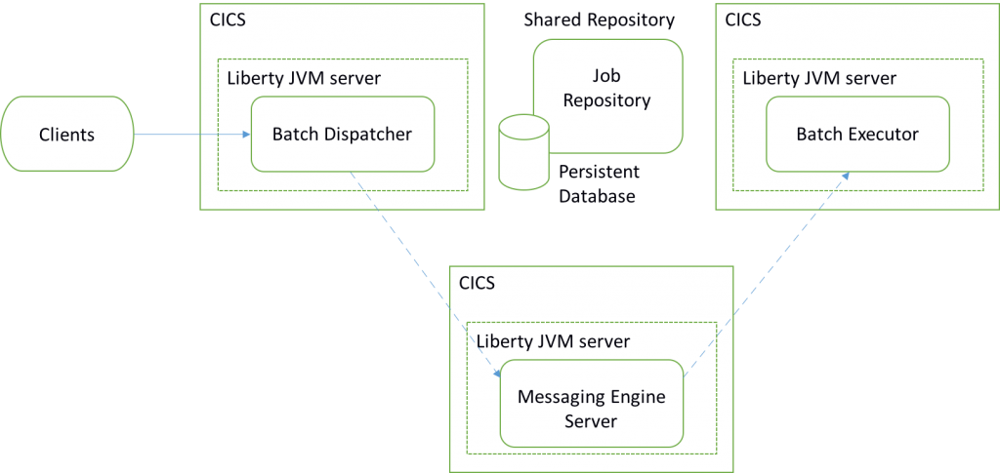

You can see there are three CICS regions, each containing a Liberty JVM
server. The **batch dispatcher** receives job requests from a clients
and places them onto a message queue residing in the messaging engine.
The **messaging engine** holds the queues for requests. The **batch executor** takes requests from the queue and runs them. You can easily
expand the topology to have multiple batch executors which can select
specific application requests from the queue and execute them.

To make the batch dispatcher and batch executor work with each other,
you must set up a shared **job repository** using a persistent database.
In this scenario I chose DB2 because you cannot use the default
in-memory batch persistence as it isolates job information from other
servers. Under the in-memory persistence mode, the batch executor cannot
obtain job information written by the batch dispatcher, and thus cannot
pick up a request from the messaging engine.

Developing your first batch application
---------------------------------------

I strongly recommend using the WebSphere Developer Tools (WDT) as it
provides useful wizards to develop a Java batch application. Follow the
information [here](https://www.ibm.com/support/knowledgecenter/SSHR6W/com.ibm.websphere.wdt.doc/topics/welcome_wdt.htm)
to install it into a suitable development environment.

Another requirement is to install the CICS Explorer SDK into your
Eclipse environment. If you don't have this already installed, follow
the guide on the [Mainframe
Development](https://developer.ibm.com/mainframe/products/downloads/#p2)
site.

1.  With WDT and CICS Explorer SDK installed into your development
    environment, you can download and install the Liberty Java EE batch
    feature via the WebSphere Software Installer. In Eclipse, click
    **Menu → Help → Install WebSphere Software...**.

    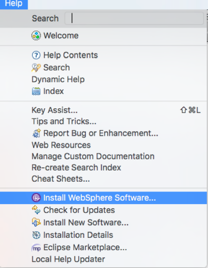

2.  Find the IBM Java EE Batch feature and click **Install**. You will
    need to re-start Eclipse after the installation.

    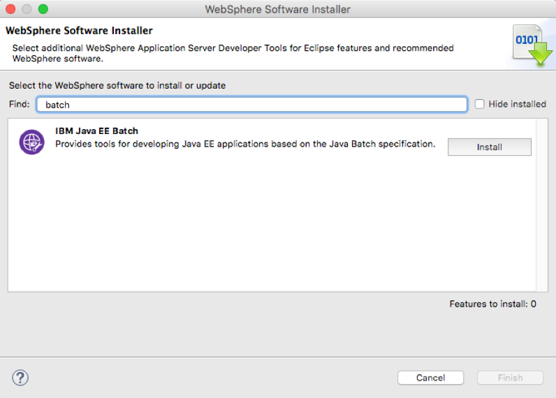

3.  To create your first Java batch application, select **File → New →
    Other...**. Under Wizards find and select **Java EE Batch Project**
    **→** **Next**.

    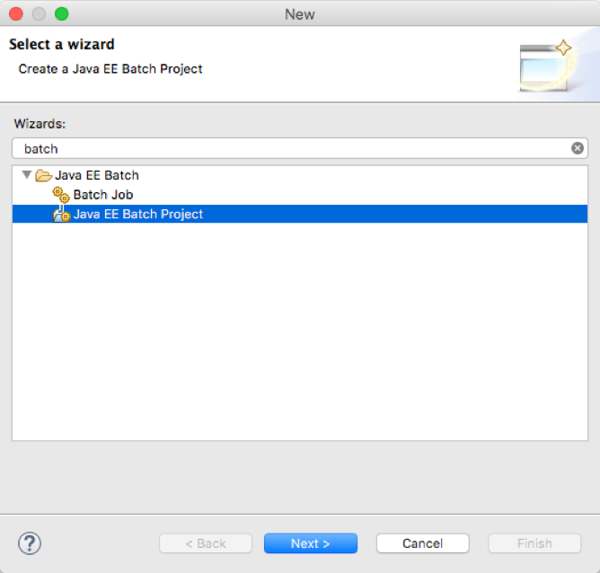

4.  Name your first batch project and add the batch project to a Dynamic
    Web project. Click on **New...** if you need to create a new Dynamic
    Web project now, otherwise select an existing one. You will deploy
    the web project to CICS Liberty later.

    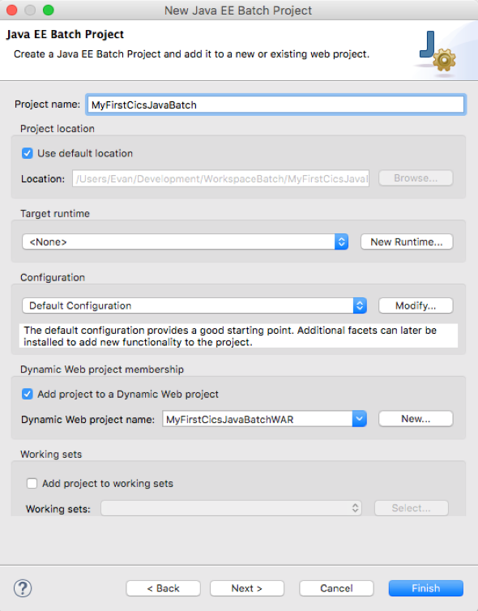

5.  Now you should have two new projects, a batch project and a web
    project visible in the Project Explorer. As this example uses both
    batch APIs and CICS APIs, you need to add the CICS & Liberty Java
    libraries to the build path. Right click your batch project, then
    **Build Path → Configure Build Path...** Switch to the Library tab,
    then **Add Library...** Select **Liberty JVM server libraries**, and
    then
    **Next**.

    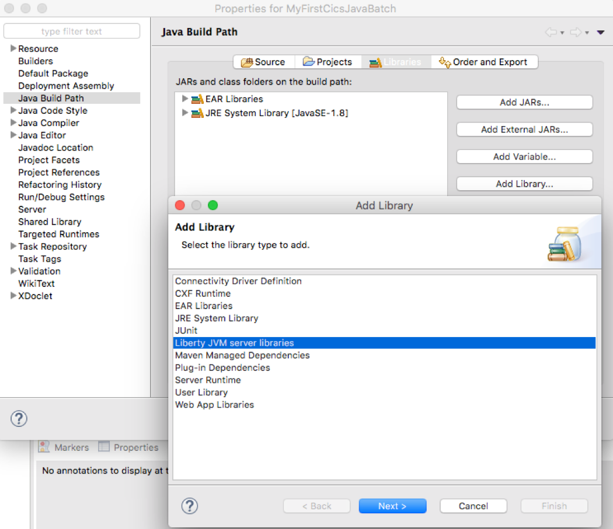

6.  Select **CICS TS 5.3** **→**
    **Finish**.!

    [](blog-graphics/LibetyJVMServer53.png)

7.  You are now in a position to write your batch logic. In this
    example, we provide a simple batchlet to print the CICS task number.
    The batchlet is a task-oriented batch step type that can be used for
    any type of background processing that does not explicitly call for
    a chunk oriented approach. This batch pattern is invoked once, runs
    to completion, and returns an exit status. If you want to use this
    batchlet source, first create a package
    **com.ibm.cics.javaee7.batch** and then create a class called
    **simpleBatchlet.java** under the new created
    package.

    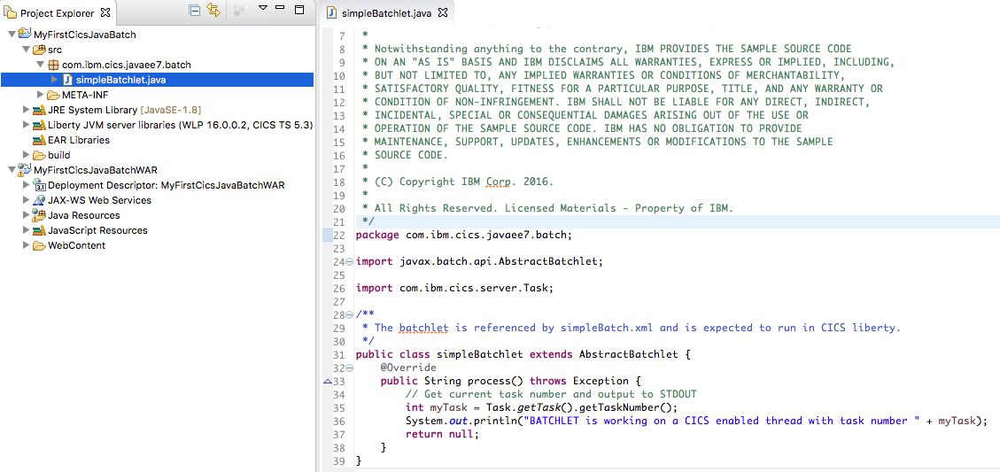

8.  Now create a batch job to define the structure of your batch. Right
    click batch-jobs under **src/META-INF** **→** **New → Other... →
    Batch Job**. Name the new batch job
    **simpleBatchlet**.

    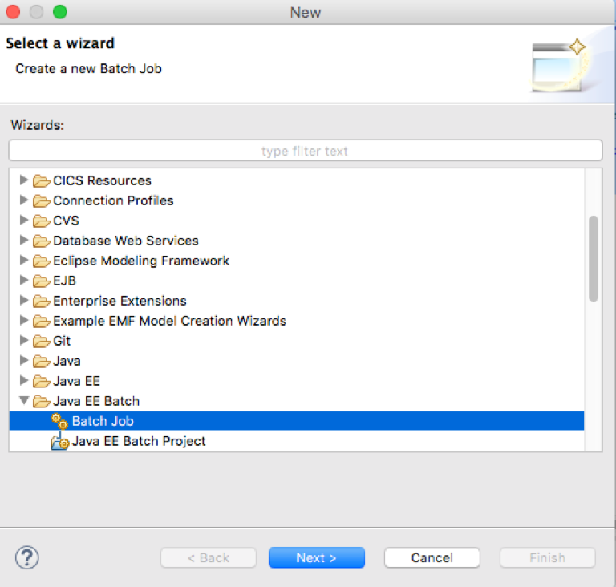

    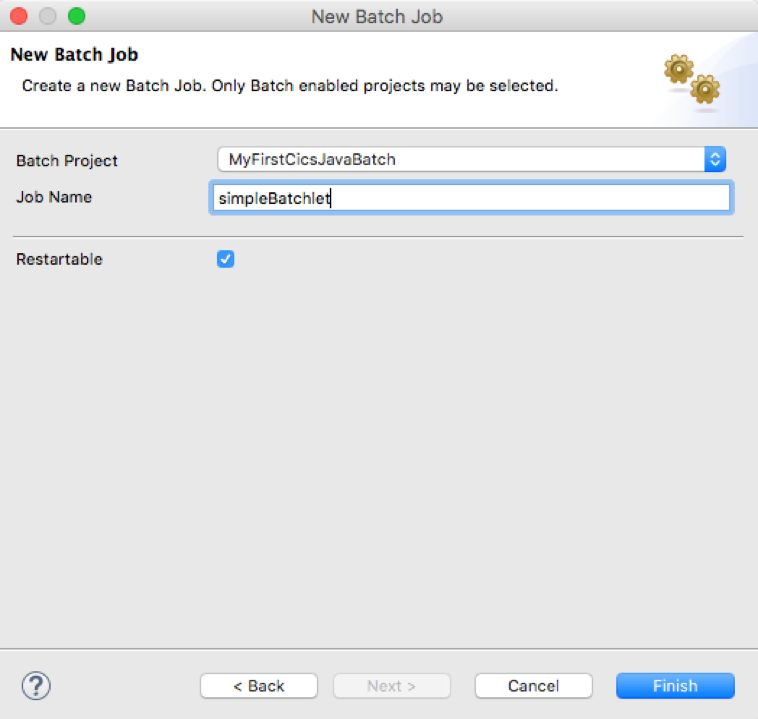

9.  Use the **JSL Editor** to add a batchlet step to the job first, then
    add a batchlet to the step, and make the batchlet refer to the
    simpleBatchlet class you just created. JSL is an abbreviation for
    Job Specification Language and is implemented in XML. Declare the
    specification of the job and the steps contained in the job. You now
    have the "Job
    XML".

    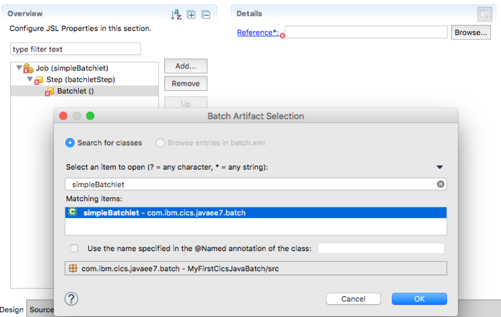

### [Batch samples in Github]

If you want to try other samples before developing your own, then take a
look at those in WASDev Github. There are two very good samples:

-   [sleepybatchlet](https://github.com/WASdev/sample.batch.sleepybatchlet) sample
-   [bonuspayout](https://github.com/WASdev/sample.batch.bonuspayout) sample

Create batch persistence tables in DB2 as a shared repository
-------------------------------------------------------------

Java batch uses a persistent store to keep the status, checkpoints, and
batch application restart data across multiple runs of a batch job. The
persistent store enables a job instance to be restarted if an earlier
run fails.

There are two types of persistence configuration: memory-based
persistence and database persistence. For a multiple server topology,
database persistence is required. For more information, you can refer to
IBM Knowledge Center [Java batch persistence
configuration](http://www.ibm.com/support/knowledgecenter/SSEQTP_8.5.5/com.ibm.websphere.wlp.doc/ae/rwlp_batch_persistence_config.html).

To configure the database persistence follow these steps. First, use
Liberty supplied **ddlGen** utility to generate the Data Definition
Language (DDL) as described in topic [Running the ddlGen
utility](http://www.ibm.com/support/knowledgecenter/SSEQTP_8.5.5/com.ibm.websphere.wlp.doc/ae/twlp_ddlgen.html).
Next you may need to customise the DDL before using it with your
database to create the tables. For example, if you use DB2 for z/OS, you
will need to define a LOB (Large Object) table space as well as indexes.
If necessary, seek the help of your database administrator. For a full
example see my
[java-batch-ddl-example](Java-Batch-DDL-example.txt)
but note later versions of ddlGen may generate different tables so only
use this example for information only.

Set up a CICS region as the messaging engine server
---------------------------------------------------

Define and install a [Liberty JVM
server](http://www.ibm.com/support/knowledgecenter/SSGMCP_5.3.0/com.ibm.cics.ts.java.doc/JVMserver/config_jvmserver_liberty.html)
in the "Messaging Engine" CICS region. Locate the server.xml of the
Liberty server on the z/OS Unix file system, typically in the
subdirectory `wlp/usr/servers/defaultServer`. Edit `server.xml` to enable
the Liberty embedded JMS server as follows:

1.  Add the \<wasJmsServer-1.0\> element to the \<featureManager\>
    element.
```
        <feature>wasJmsServer-1.0</feature>
```
2.  Add the \<wasJmsEndpoint\> element to define JMS endport with a
    non-SSL port or an SSL port. The Batch dispatcher and batch executor
    will use these ports to put and get messages from the JMS queue.
```
        <wasJmsEndpoint enabled="true" host="*" id="InboundJmsEndpoint" wasJmsPort="7280" wasJmsSSLPort="7290">
        </wasJmsEndpoint>
```
3.  Add \<MesagingEngine\> element to configure a message engine for the
    batch queue.
```
        <messagingEngine>
           <queue forceReliability="ReliablePersistent" id="batchLibertyQueue" receiveAllowed="true"/>
        </messagingEngine>
```
4.  Review STDOUT log of the JVM server to check the messaging engine
    starts ok. STDOUT is configured in your JVM profile. Eclipse view
    "z/OS UNIX Files" is a good way to list, view and edit zFS files.
```
        [INFO    ] CWWKO0219I: TCP Channel InboundJmsEndpoint has been started and is now listening for requests on host *  (IPv6) port 7280.
        [INFO    ] CWWKO0219I: TCP Channel InboundJmsEndpoint-ssl has been started and is now listening for requests on host *  (IPv6) port 7290.
        [INFO    ] CWSID0108I: JMS server has started.
```
Set up a CICS region as the batch dispatcher
--------------------------------------------

Define and install a [Liberty JVM
server](http://www.ibm.com/support/knowledgecenter/SSGMCP_5.3.0/com.ibm.cics.ts.java.doc/JVMserver/config_jvmserver_liberty.html)
in the "Dispatcher" CICS region, then make the following changes to
`server.xml`:

1.  Add the wasJmsClient-2.0 feature within the \<featureManager\>
    element to enable the dispatcher as a JMS client.
```
        <feature>wasJmsClient-2.0</feature>
```
2.  Add the \<batchJmsDispatcher\> element to refer to a
    connectionFactory and a queue so that the dispatcher can put a
    message to a connected queue once it receives a batch request.
```
        <batchJmsDispatcher connectionFactoryRef="batchConnectionFactory" queueRef="batchJobSubmissionQueue"/>
```
3.  Add the \<jmsConnectionFactory\> element with a jndiName of
    jms/batch/connectionFactory and with the remoteServerAddress
    property to point the JMS endpoint.
```
        <jmsConnectionFactory id="batchConnectionFactory" jndiName="jms/batch/connectionFactory">
           <properties.wasJms remoteServerAddress="winmvs2c.hursley.ibm.com:7280:BootstrapBasicMessaging"/>
        </jmsConnectionFactory>
```
4.  Add the \<jmsQueue\> element with a jndiName of
    jms/batch/jobSubmissionQueue and name a proper queueName. The
    queueName is used by the batch executor to get messages.
```
        <jmsQueue id="batchJobSubmissionQueue" jndiName="jms/batch/jobSubmissionQueue">
           <properties.wasJms deliveryMode="Persistent" queueName="batchLibertyQueue"/>
        </jmsQueue>
```
5.  Add the batchManagement-1.0 feature under the \<featureManager\>
    element to enable Liberty batch management functions including batch
    REST API, multi-server support and batchManager command line
    interface.
```
        <feature>batchManagement-1.0</feature>
```
6.  Add the \<batchPersistence\> element to configure the job repository
    that resides in DB2. You need to change the schema, databaseName,
    portNumber, and serverName based on your DB2 configuration.
```
        <batchPersistence jobStoreRef="BatchDatabaseStore"/>
        <databaseStore dataSourceRef="batchDB" id="BatchDatabaseStore" schema="++schema++" tablePrefix=""/>
        <dataSource id="batchDB" jndiName="jdbc/batch">
           <jdbcDriver>
              <library name="DB2LIB">
                 <fileset dir="/usr/lpp/db2v11/jdbc/classes" includes="db2jcc4.jar db2jcc_license_cisuz.jar"/>
                 <fileset dir="/usr/lpp/db2v11/jdbc/lib"/>
              </library>
           </jdbcDriver>
           <properties.db2.jcc currentSchema="++schema++" databaseName="++database++" driverType="4" password="xxxxxxxx" portNumber="++db2port++" serverName="++serverHost++" user="xxxxxxxx"/>
        </dataSource>
```
7.  Add a basicRegistry and enable batch roles. It is recommended you
    use the SAF registry and SAF authorisation for production systems.
    For more information on securing Liberty batch, refer to topic
    [Securing the Liberty batch
    environment](http://www.ibm.com/support/knowledgecenter/en/SS7K4U_liberty/com.ibm.websphere.wlp.zseries.doc/ae/twlp_batch_securing.html).
```
        <basicRegistry id="basic" realm="ibm/api">
           <user name="bob" password="bobpwd"/>
           <user name="jane" password="janepwd"/>
        </basicRegistry>

        <authorization-roles id="com.ibm.ws.batch">
           <security-role name="batchAdmin">
              <user name="bob"/>
           </security-role>
        </authorization-roles>
```
8.  Review STDOUT log of the JVM server to ensure the batch JPA
    persistence service is activated and the batch web module ibm/api is
    started. If batch JPA persistence was not activated and in-memory
    persistence was enabled instead, it indicates a problem with your
    batch database configuration.
```
        [INFO    ] CWWKY0005I: The batch JPA persistence service is activated.
        [INFO    ] CWWKY0008I: The batch feature is using persistence type JPA.
        …
        [INFO    ] SRVE0169I: Loading Web Module: ibm/api.
        [INFO    ] SRVE0250I: Web Module ibm/api has been bound to default_host.
        [AUDIT   ] CWWKT0016I: Web application available (default_host): http://winmvs2c.hursley.ibm.com:22805/ibm/api/
```
Set up a CICS region as the batch executor
------------------------------------------

Define and install a [Liberty JVM
server](http://www.ibm.com/support/knowledgecenter/SSGMCP_5.3.0/com.ibm.cics.ts.java.doc/JVMserver/config_jvmserver_liberty.html)
in the CICS region, then locate the server.xml configuration file for
the Liberty server and edit it as follows:

1.  Define your batch application by adding the \<webApplication\>
    element with the z/OS file system location of your war file.
```
        <webApplication id="MyFirstCicsJavaBatchWAR" location="/your_zFS_application_directory/MyFirstCicsJavaBatchWAR.war" name="MyFirstCicsJavaBatchWAR"/>
```
2.  Add the wasJmsClient-2.0 feature under the \<featureManager\>
    element to enable the executor as a JMS client.
```
        <feature>wasJmsClient-2.0</feature>
```
3.  Add the \<batchJmsExecutor\> element to refer to an activation
    specification and a queue.
```
        <batchJmsExecutor activationSpecRef="batchActivationSpec" queueRef="batchRequestsQueue"/>
```
4.  Add the \<jmsActivationSpec\> element to specify how to activate the
    batch application as a result of the messages on the JMS queue. You
    need to give a correct application name for the "messageSelector"
    attribute and specify the JMS endpoint you set up for messaging
    engine server for "remoteServerAddress". If you don't use the sample
    application provided in this tutorial, remember to specify your
    application name, otherwise you will receive a "JMS_QUEUED" response
    when invoking your batch application from the dispatcher.
```
        <jmsActivationSpec id="batchActivationSpec" maxEndpoints="5">
           <properties.wasJms destinationRef="batchRequestsQueue" destinationType="javax.jms.Queue" messageSelector="com_ibm_ws_batch_applicationName = 'MyFirstCicsJavaBatchWAR'" remoteServerAddress="winmvs2c.hursley.ibm.com:7280:BootstrapBasicMessaging">
           </properties.wasJms>
        </jmsActivationSpec>
```
5.  Add element \<jmsQueue\> with a jndiName
    `jms/batch/jobSubmissionQueue` and with the same queueName you
    specified for the dispatcher server. Now you should be able to
    understand how Java batch splits the workload. The dispatcher routes
    batch requests to a message queue, and then executors listen to a
    certain queue for the request. Once a request message is put onto
    the queue, the application is invoked by the executor.
```
        <jmsQueue id="batchRequestsQueue" jndiName="jms/batch/jobSubmissionQueue">
           <properties.wasJms deliveryMode="Persistent" queueName="batchLibertyQueue"/>
        </jmsQueue>
```
6.  Add the batchManagement-1.0 feature under the \<featureManager\>
    element to enable Liberty batch management functions. Here we need
    multi-server support from this feature.
```
        <feature>batchManagement-1.0</feature>
```
7.  Add the element to configure the job repository that resides in DB2.
    You need to change the `schema/databaseName/portNumber/serverName`
    based on your DB2 configuration.
```
        <batchPersistence jobStoreRef="BatchDatabaseStore"/>
        <databaseStore dataSourceRef="batchDB" id="BatchDatabaseStore" schema="++schema++" tablePrefix=""/>
        <dataSource id="batchDB" jndiName="jdbc/batch">
           <jdbcDriver>
              <library name="DB2LIB">
                 <fileset dir="/usr/lpp/db2v11/jdbc/classes" includes="db2jcc4.jar db2jcc_license_cisuz.jar"/>
                 <fileset dir="/usr/lpp/db2v11/jdbc/lib"/>
              </library>
           </jdbcDriver>
           <properties.db2.jcc currentSchema="++schema++" databaseName="++database++" driverType="4" password="xxxxxxxx" portNumber="++db2port++" serverName="++serverHost++" user="xxxxxxxx"/>
        </dataSource>
```
8.  Add a basicRegistry and enable the batch roles shown below. It is
    recommended to use a SAF registry for authorisation in production.
    For more information on securing Liberty batch, refer to topic
    [Securing the Liberty batch
    environment](http://www.ibm.com/support/knowledgecenter/en/SS7K4U_liberty/com.ibm.websphere.wlp.zseries.doc/ae/twlp_batch_securing.html).
```
        <basicRegistry id="basic" realm="ibm/api">
           <user name="bob" password="bobpwd"/>
           <user name="jane" password="janepwd"/>
        </basicRegistry>

        <authorization-roles id="com.ibm.ws.batch">
           <security-role name="batchAdmin">
              <user name="bob"/>
           </security-role>
        </authorization-roles>
```
9.  Review STDOUT log of the JVM server to check the batch JPA
    persistence service is activated, the batch application
    MyFirstCicsJavaBatchWAR is installed, and the message endpoint is
    activated.
```
        [INFO    ] CWWKY0005I: The batch JPA persistence service is activated.
        [INFO    ] CWWKY0008I: The batch feature is using persistence type JPA.
        …
        [INFO    ] CWWKZ0018I: Starting application MyFirstCicsJavaBatchWAR.
        [INFO    ] SRVE0169I: Loading Web Module: MyFirstCicsJavaBatchWAR.
        [INFO    ] SRVE0250I: Web Module MyFirstCicsJavaBatchWAR has been bound to default_host.
        [AUDIT   ] CWWKT0016I: Web application available (default_host): http://winmvs2c.hursley.ibm.com:22807/MyFirstCicsJavaBatchWAR/
        [AUDIT   ] CWWKZ0001I: Application MyFirstCicsJavaBatchWAR started in 0.076 seconds.
        …
        [INFO    ] J2CA8804I: The message endpoint for activation specification batchActivationSpec and message driven bean application JBatchListenerApp#JBatchListenerModule#JBatchListenerComp is deactivated.
        [INFO    ] CWSIV0777I: A connection to messaging engine defaultME for destination batchLibertyQueue on bus defaultBus has been successfully created.
        [INFO    ] CWSIV0556I: Connection to the Messaging Engine was successful. The message-driven bean with activation specification batchActivationSpec will now be able to receive the messages from destination batchLibertyQueue.
        [INFO    ] J2CA8801I: The message endpoint for activation specification batchActivationSpec and message driven bean application JBatchListenerApp#JBatchListenerModule#JBatchListenerComp is activated.
        [INFO    ] J2CA8804I: The message endpoint for activation specification batchActivationSpec and message driven bean application JBatchListenerApp#JBatchListenerModule#JBatchListenerComp is deactivated.
        [INFO    ] CWSIV0777I: A connection to messaging engine defaultME for destination batchLibertyQueue on bus defaultBus has been successfully created.
        [INFO    ] CWSIV0556I: Connection to the Messaging Engine was successful. The message-driven bean with activation specification batchActivationSpec will now be able to receive the messages from destination batchLibertyQueue.
        [INFO    ] J2CA8801I: The message endpoint for activation specification batchActivationSpec and message driven bean application JBatchListenerApp#JBatchListenerModule#JBatchListenerComp is activated.
        [AUDIT   ] CWWKG0017I: The server configuration was successfully updated in 0.079 seconds.
```
Submit a job request to the batch dispatcher
--------------------------------------------

The batchManagement-1.0 feature provides several methods to access
information about batch jobs. Here we will show two methods; the first
uses a REST client to submit JSON, and the second uses a telnet client
and the batchManager utility.

### Using a REST client to submit and monitor jobs {#using-a-rest-client-to-submit-and-monitor-jobs .western}

1.  Install the
    [RESTClient](https://addons.mozilla.org/en-US/firefox/addon/restclient/)
    addon in to your Firefox browser.

2.  In a Firefox new tab, enter the URL
    **https://\<host\>:\<secure_port\>/ibm/api/batch/jobinstances/**
    replacing \<host\> and \<secure_port\> with those of the dispatcher
    server.

    

3.  Accept the security challenge.

4.  You will be prompted for an ID and password -- use *bob* and
    *bobpwd* as was defined in the basicRegistry in this example. The
    user bob was also defined in batchAdmin.

    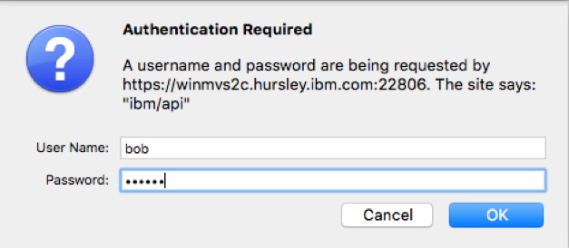

5.  As you have not submitted a job request yet, the response in JSON
    format will be an empty array "\[\]".

    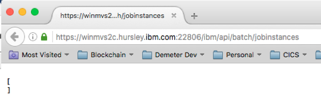

6.  Now you can submit your first batch request. Open the RESTClient
    installed in previous step.
    

7.  Set Method to POST, and input the URL as step 2.
    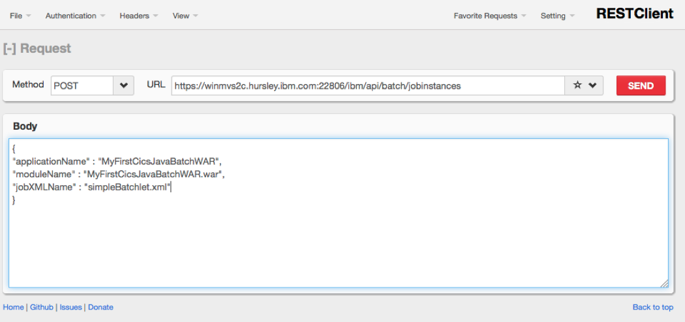

8.  You should see a 201 HTTP response.
    

9.  Re-submit another GET request from step 2, and you should see the
    batch status. **Note:** if the batchStatus stays in JMS_QUEUED, it
    means batch executor has not picked up the request for the
    application. Check whether you specified the correct name in
    server.xml for the batch executor. Another possible reason is that
    the batch executor cannot retrieve batch information from the shared
    repository in DB2. Check the Liberty log and trace for further
    problem determination.

    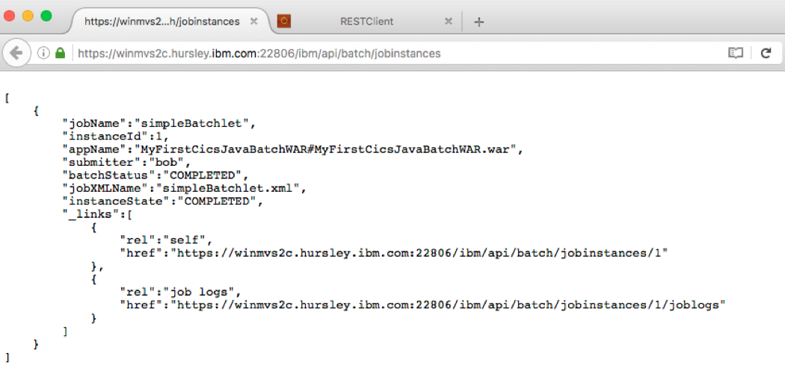

10. Review STDOUT log of the JVM server for batch executor Liberty
    server and you should be able to see the batchlet was executed in a
    CICS task.
```
        [INFO    ] SESN0176I: A new session context will be created for application key default_host/ibm/api
        [INFO    ] SESN0172I: The session manager is using the Java default SecureRandom implementation for session ID generation.
        [INFO    ] DYNA1056I: Dynamic Cache (object cache) initialized successfully.
        [INFO    ] J2CA8050I: An authentication alias should be used instead of defining a user name and password on dataSource[batchDB].
        [INFO    ] DSRA8203I: Database product name : DB2
        [INFO    ] DSRA8204I: Database product version : DSN11015
        [INFO    ] DSRA8205I: JDBC driver name  : IBM Data Server Driver for JDBC and SQLJ
        [INFO    ] DSRA8206I: JDBC driver version  : 4.19.56
        [INFO    ] SESN0176I: A new session context will be created for application key default_host/MyFirstCicsJavaBatchWAR
        [INFO    ] SESN0172I: The session manager is using the Java default SecureRandom implementation for session ID generation.
        BATCHLET is working on a CICS enabled thread with task number 78
```
Using the batchManager utility to submit and monitor jobs
---------------------------------------------------------

1.  Logon to USS using a secure shell or OMVS.

2.  Export JAVA_HOME to your JDK installation directory.

3.  Change directory to \<WORK_DIR\>/\<APPLID\>/\<JVMSERVER\> where
    WORK_DIR is specified in your JVM profile, APPLID is the value of
    the CICS region APPLID and JVMSERVER is the name of the JVMSERVER
    resource. You should be able to see a script called **wlpenv**.

4.  Run the following command:
```
        ./wlpenv batchManager submit --batchManager=<host>:<port>  --trustSslCertificates
         --user=bob --password=bobpwd --applicationName= MyFirstCicsJavaBatchWAR --jobXMLName=simpleBatchlet.xml --wait
         ```

    In the command above, --wait is used so the command will wait until the job completes. You should be able to see the following response.

```
        [2016/09/08 11:23:49.959 +0100] CWWKY0101I: Job (NOT SET) with instance ID 2 has been submitted.
        [2016/09/08 11:23:49.960 +0100] CWWKY0106I: JobInstance:{"jobName":"(NOT SET)","instanceId":2,"appName":"MyFirstCicsJavaBatchWAR#MyFirstCicsJavaBatchWAR.war","submitter":"bob","batchStatus":"STARTING","jobXMLName":"simpleBatchlet.xml","instanceState":"JMS_QUEUED"}
        [2016/09/08 11:24:20.244 +0100] CWWKY0105I: Job (NOT SET) with instance ID 2 has finished. Batch status: COMPLETED. Exit status: COMPLETED
        [2016/09/08 11:24:20.245 +0100] CWWKY0107I: JobExecution:{"jobName":"simpleBatchlet","executionId":2,"instanceId":2,"batchStatus":"COMPLETED","exitStatus":"COMPLETED","createTime":"2016/09/08 10:23:49.874 +0000","endTime":"2016/09/08 10:23:50.372 +0000","lastUpdatedTime":"2016/09/08 10:23:50.372 +0000","startTime":"2016/09/08 10:23:50.267 +0000","jobParameters":{},"restUrl":"https://winmvs2c.hursley.ibm.com:22808/ibm/api/batch","serverId":"localhost//u/evancho/demeter/workdir/IYK2ZLS3/BATCHEX1/wlp/usr/evandev","logpath":"/u/evancho/demeter/workdir/IYK2ZLS3/BATCHEX1/wlp/user/servers/evandev/logs/joblogs/simpleBatchlet/2016-09-08/instance.2/execution.2/","stepExecutions":[{"stepExecutionId":2,"stepName":"batchletStep","batchStatus":"COMPLETED","exitStatus":"COMPLETED","stepExecution":"https://winmvs2c.hursley.ibm.com:22806/ibm/api/batch/jobexecutions/2/stepexecutions/batchletStep"}]}
```
5.  Run the following command to list existing jobs:
```
        ./wlpenv batchManager listJobs --batchManager=<host>:<port>  --trustSslCertificates
         --user=bob --password=bobpwd
```

    You should see that two jobs completed, one was submitted by REST client, and the second one was submitted via batchManager utility.

```
        [2016/09/08 11:28:26.345 +0100] CWWKY0106I: JobInstance:{"jobName":"simpleBatchlet","instanceId":2,"appName":"MyFirstCicsJavaBatchWAR#MyFirstCicsJavaBatchWAR.war","submitter":"bob","batchStatus":"COMPLETED","jobXMLName":"simpleBatchlet.xml","instanceState":"COMPLETED"}
        [2016/09/08 11:28:26.345 +0100] CWWKY0106I: JobInstance:{"jobName":"simpleBatchlet","instanceId":1,"appName":"MyFirstCicsJavaBatchWAR#MyFirstCicsJavaBatchWAR.war","submitter":"bob","batchStatus":"COMPLETED","jobXMLName":"simpleBatchlet.xml","instanceState":"COMPLETED"}
```
6.  Send a GET request from your Firefox and you should see the same
    result.

    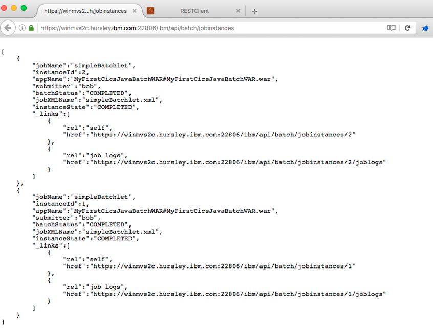

7.  The batchManagement-1.0 feature provides a mechanism for writing job
    logs to a separate location and file from the standard server output
    location. The logs are stored under ///wlp.SERVERNAME.logs/joblogs
    where WORKDIR is specified in your JVM profile, APPLID is the value
    of the CICS region APPLID, JVMSERVER is the name of the JVMSERVER
    resource and SERVERNAME is also specified in your JVM profile as
    defined by *-Dcom.ibm.cics.jvmserver.wlp.server.name*. Here is an
    example of my joblogs directory. My executor region APPLID is
    *IYK2ZLS3* and JVMSERVER resource name is *BATCHEX1*. My wlp server
    name is *evandev*.

    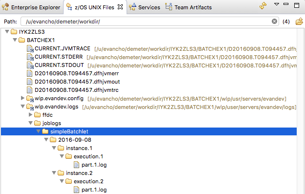

8.  The log file contains detailed logging information from
    com.ibm.jbatch.container.\*, and you will see something like this:
```
        [9/8/16 10:23:50:255 GMT] com.ibm.jbatch.container.execution.impl.RuntimeJobExecution    updateExecutionJobLogDir ENTRY /u/evancho/demeter/workdir/IYK2ZLS3/BATCHEX1/wlp/user/servers/evandev/logs/joblogs/simpleBatchlet/2016-09-08/instance.2/execution.2/
        [9/8/16 10:23:50:255 GMT] com.ibm.jbatch.container.execution.impl.RuntimeWorkUnitExecu   getPersistenceManagerService ENTRY
        [9/8/16 10:23:50:255 GMT] com.ibm.jbatch.container.servicesmanager.ServicesManagerImpl   getPersistenceManagerService ENTRY
        [9/8/16 10:23:50:255 GMT] com.ibm.jbatch.container.servicesmanager.ServicesManagerImpl   getPersistenceManagerService RETURN com.ibm.jbatch.container.services.impl.JPAPersistenceManagerImpl@343906e5
        [9/8/16 10:23:50:255 GMT] com.ibm.jbatch.container.execution.impl.RuntimeWorkUnitExecu   getPersistenceManagerService RETURN com.ibm.jbatch.container.services.impl.JPAPersistenceManagerImpl@343906e5
        [9/8/16 10:23:50:255 GMT] com.ibm.jbatch.container.execution.impl.RuntimeWorkUnitExecu   getTopLevelExecutionId ENTRY
        [9/8/16 10:23:50:255 GMT] com.ibm.jbatch.container.execution.impl.RuntimeWorkUnitExecu   getTopLevelExecutionId RETURN 2
        [9/8/16 10:23:50:255 GMT] com.ibm.jbatch.container.services.impl.JPAPersistenceManager   updateJobExecutionLogDir ENTRY 2 /u/evancho/demeter/workdir/IYK2ZLS3/BATCHEX1/wlp/user/servers/evandev/logs/joblogs/simpleBatchlet/2016-09-08/instance.2/execution.2/
        [9/8/16 10:23:50:255 GMT] com.ibm.jbatch.container.services.impl.JPAPersistenceManager   getPsu ENTRY
        [9/8/16 10:23:50:255 GMT] com.ibm.jbatch.container.services.impl.JPAPersistenceManager   getPsu RETURN com.ibm.wsspi.persistence.internal.PersistenceServiceUnitImpl@f2cbd293
        [9/8/16 10:23:50:256 GMT] com.ibm.jbatch.container.services.impl.JPAPersistenceManager   Suspending current LTC and beginning new transaction
        [9/8/16 10:23:50:262 GMT] com.ibm.jbatch.container.services.impl.JPAPersistenceManager   Committing new transaction we started.
        [9/8/16 10:23:50:266 GMT] com.ibm.jbatch.container.services.impl.JPAPersistenceManager   updateJobExecutionLogDir RETURN From JobThreadExecutionBase: batchStatus = STARTING, exitStatus = null, restUrl = https://winmvs2c.hursley.ibm.com:22808/ibm/api/batch, logpath = /u/evancho/demeter/workdir/IYK2ZLS3/BATCHEX1/wlp/user/servers/evandev/logs/joblogs/simpleBatchlet/2016-09-08/instance.2/execution.2/, serverId = localhost//u/evancho/demeter/workdir/IYK2ZLS3/BATCHEX1/wlp/usr/evandev
        For JobExecutionEntity: execution Id = 2, execution sequence num = 0, instance = For JobInstanceEntity:  instanceId = 2, batchStatus = STARTING
        [9/8/16 10:23:50:266 GMT] com.ibm.jbatch.container.execution.impl.RuntimeJobExecution    updateExecutionJobLogDir RETURN
        [9/8/16 10:23:50:266 GMT] com.ibm.jbatch.container.execution.impl.RuntimeWorkUnitExecu   logExecutionStartingMessage ENTRY
        [9/8/16 10:23:50:266 GMT] com.ibm.jbatch.container.execution.impl.RuntimeWorkUnitExecu   getTopLevelNameInstanceExecutionInfo ENTRY
        [9/8/16 10:23:50:266 GMT] com.ibm.jbatch.container.execution.impl.RuntimeWorkUnitExecu   getTopLevelNameInstanceExecutionInfo RETURN TopLevelNameIntanceExecutionInfo:jobName=simpleBatchlet:instanceId=2:executionId=2
        [9/8/16 10:23:50:266 GMT] com.ibm.jbatch.container.execution.impl.RuntimeWorkUnitExecu   getTopLevelNameInstanceExecutionInfo ENTRY
        [9/8/16 10:23:50:266 GMT] com.ibm.jbatch.container.execution.impl.RuntimeWorkUnitExecu   getTopLevelNameInstanceExecutionInfo RETURN TopLevelNameIntanceExecutionInfo:jobName=simpleBatchlet:instanceId=2:executionId=2
        [9/8/16 10:23:50:266 GMT] com.ibm.jbatch.container.execution.impl.RuntimeWorkUnitExecu   getTopLevelNameInstanceExecutionInfo ENTRY
        [9/8/16 10:23:50:266 GMT] com.ibm.jbatch.container.execution.impl.RuntimeWorkUnitExecu   getTopLevelNameInstanceExecutionInfo RETURN TopLevelNameIntanceExecutionInfo:jobName=simpleBatchlet:instanceId=2:executionId=2
        [9/8/16 10:23:50:266 GMT] com.ibm.jbatch.container.execution.impl.RuntimeWorkUnitExecu   getTopLevelNameInstanceExecutionInfo ENTRY
        [9/8/16 10:23:50:266 GMT] com.ibm.jbatch.container.execution.impl.RuntimeWorkUnitExecu   getTopLevelNameInstanceExecutionInfo RETURN TopLevelNameIntanceExecutionInfo:jobName=simpleBatchlet:instanceId=2:executionId=2
        [9/8/16 10:23:50:266 GMT] com.ibm.jbatch.container.execution.impl.RuntimeJobExecution    getClassNameLogger ENTRY
        [9/8/16 10:23:50:266 GMT] com.ibm.jbatch.container.execution.impl.RuntimeJobExecution    getClassNameLogger RETURN com.ibm.ws.logging.internal.WsLogger@130f7c70
        [9/8/16 10:23:50:267 GMT] com.ibm.jbatch.container.execution.impl.RuntimeJobExecution    
        ==========================================================
        Started invoking execution for a job
         JobInstance id = 2
         JobExecution id = 2
         Job Name = simpleBatchlet
         Job Parameters = {}
        ==========================================================
        ...
        ==========================================================
        Completed invoking execution for a job
         JobInstance id = 2
         JobExecution id = 2
         Job Name = simpleBatchlet
         Job Parameters = {}
         Job Batch Status = COMPLETED, Job Exit Status = COMPLETED
        ==========================================================

        [9/8/16 10:23:50:383 GMT] com.ibm.jbatch.container.execution.impl.RuntimeWorkUnitExecu   logExecutionCompletedMessage RETURN
        [9/8/16 10:23:50:384 GMT] com.ibm.jbatch.container.impl.BatchKernelImpl                  workUnitCompleted ENTRY com.ibm.jbatch.container.util.BatchJobWorkUnit@6f0dec23
        [9/8/16 10:23:50:384 GMT] com.ibm.jbatch.container.execution.impl.RuntimeWorkUnitExecu   getTopLevelNameInstanceExecutionInfo ENTRY
        [9/8/16 10:23:50:384 GMT] com.ibm.jbatch.container.execution.impl.RuntimeWorkUnitExecu   getTopLevelNameInstanceExecutionInfo RETURN TopLevelNameIntanceExecutionInfo:jobName=simpleBatchlet:instanceId=2:executionId=2
        [9/8/16 10:23:50:384 GMT] com.ibm.jbatch.container.execution.impl.RuntimeWorkUnitExecu   getTopLevelExecutionId ENTRY
        [9/8/16 10:23:50:384 GMT] com.ibm.jbatch.container.execution.impl.RuntimeWorkUnitExecu   getTopLevelExecutionId RETURN 2
        [9/8/16 10:23:50:384 GMT] com.ibm.jbatch.container.impl.BatchKernelImpl                  job completed: For jobExecId = 2, removed job work unit
        [9/8/16 10:23:50:384 GMT] com.ibm.jbatch.container.impl.BatchKernelImpl                  workUnitCompleted RETURN
        [9/8/16 10:23:50:384 GMT] com.ibm.jbatch.container.execution.impl.RuntimeWorkUnitExecu   getTopLevelNameInstanceExecutionInfo ENTRY
        [9/8/16 10:23:50:384 GMT] com.ibm.jbatch.container.execution.impl.RuntimeWorkUnitExecu   getTopLevelNameInstanceExecutionInfo RETURN TopLevelNameIntanceExecutionInfo:jobName=simpleBatchlet:instanceId=2:executionId=2
        [9/8/16 10:23:50:384 GMT] com.ibm.jbatch.container.execution.impl.RuntimeWorkUnitExecu   getTopLevelNameInstanceExecutionInfo ENTRY
        [9/8/16 10:23:50:384 GMT] com.ibm.jbatch.container.execution.impl.RuntimeWorkUnitExecu   getTopLevelNameInstanceExecutionInfo RETURN TopLevelNameIntanceExecutionInfo:jobName=simpleBatchlet:instanceId=2:executionId=2
```
Summary
-------

In this tutorial, we developed a simple batch application using
WebSphere Developer Tools (WDT) and used a batchlet to print the CICS
task number. We packaged the batch application as a WAR file and
deployed it into a server called a batch executor.

The topology used was a configuration of three CICS regions: one as a
messaging engine using the Liberty embedded JMS messaging provider with
a batch queue, one as batch dispatcher to receive requests and to
dispatch requests by putting a message on the queue, and one as a batch
executor to listen for requests and execute them in the deployed batch
application. In a production environment it would be usual to have
multiple executors splitting the batch workload based on the
application. You could choose to combine the messaging engine server and
dispatcher, at the expense of the single dispatcher server becoming a
single point of failure. However, a more robust structure would to have
two or even more dispatchers as a parallel to CICS and multiple TORs.

To support multi-servers, Java batch persistence in a database is a must
and the tables need be shared by servers. You also need to enable the
batchManagement-1.0 feature in both the dispatcher and the executor.
This feature implicitly includes the batch-1.0 feature. If you find
requests are "JMS_QUEUED", it means the batch executor server cannot
pick up the requests from the batch queue. Possible reasons are:

-   The batch executor server is not connecting with the JMS endpoint.
-   The batch executor server specifies a mismatched application name.
-   The batch executor server cannot read shared job information from
    the job repository.

To conclude, we showed two main methods of invoking batch: the
batchManager utility from USS, and a REST interface from a REST client.
The batch request is submitted under user bob -- defined in the role of
batchAdmin. Both requests were correctly handled and completed
successfully. So what will happen if you submit a request under user
Jane? Try it 🙂

------------------------------------------------------------------------

 

### References

-   [Liberty
    features](http://www.ibm.com/support/knowledgecenter/SSGMCP_5.3.0/com.ibm.cics.ts.java.doc/topics/liberty_features.html)
    Java Batch 1.0 and Batch Management 1.0 are supported in CICS TS
    V5.3 with APAR [PI63005](https://www.ibm.com/support/pages/node/5677077)
-   [Getting started with WebSphere Developer Tools for Eclipse and
    Liberty](https://www.ibm.com/support/knowledgecenter/SSHR6W/com.ibm.websphere.wdt.doc/topics/welcome_wdt.htm)
    for WDT installation
-   [Mainframe
    Development](https://developer.ibm.com/mainframe/products/downloads/#p2)
    for CICS Explorer installation
